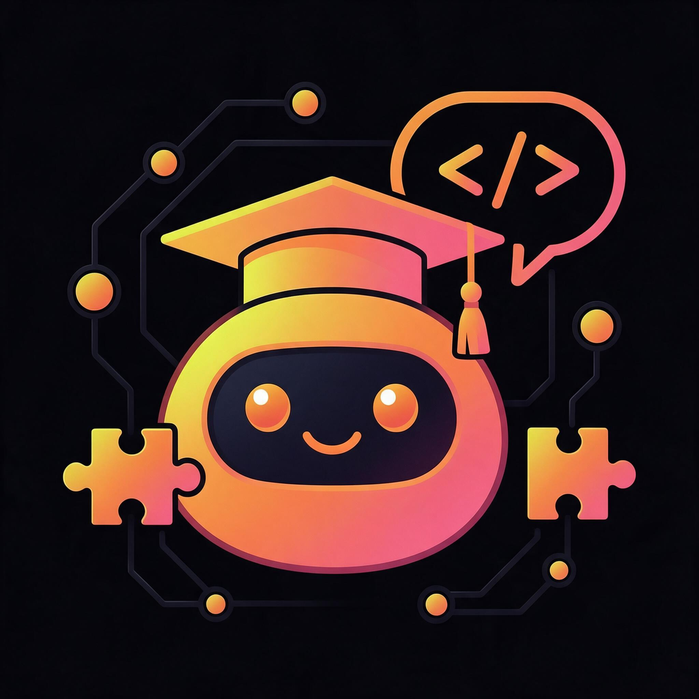

<div align="center">



# 🧑‍🏫 Instructor Skill — AI Agent Instructor

[](https://opensource.org/licenses/MIT)
[](https://claude.com)
[](https://github.com/Xu123-Bob/instructor-skill)
[](https://atomgit.com/Com_Xu/instructor-skill)

<p align="center">
  <a href="README.cn.md">简体中文</a> |
  <a href="README.en.md">English</a> 
</p>

**A Skill designed specifically for Claude Code, providing real-time explanations of how Agent internal components (Skills, Subagent, MCP, Hook, CI/CD, etc.) work during VibeCoding, so beginners can learn while using.**

</div>


---

## 📖 Introduction

`instructor` is a **progressive disclosure** skill. When the Agent executes a task, it proactively informs the user in the chat interface in the form of `<component name started running>`, indicating which component is currently being used, what that component does, and related technical details.

**Core Philosophy**: Let users understand the composition of an Agent through hands-on practice, lowering the learning barrier.

---

## ✨ Features

- ✅ **Real-time Explanation** – When the Agent triggers key components, it automatically provides clear explanations in Chinese
- ✅ **Covers Six Core Components** – CLAUDE.md, Skills, Subagent, Hook, MCP, CI/CD & Headless
- ✅ **Type Annotations** – Clearly indicates Subagent types (read-only/execution/parallel/pipeline/team), Skill trigger methods (automatic/command), etc.
- ✅ **MCP Capability Analysis** – Distinguishes among Tools, Resources, and Prompts, and explains transport methods (stdio/HTTP)
- ✅ **Hook Event Classification** – Identifies 17 event types (such as PreToolUse, SubagentStart, etc.)
- ✅ **CI/CD Security Guidelines** – Reminds about best practices such as least privilege, Secrets management, and audit logs

---

## 🚀 Quick Start

### Prerequisites

- [Claude Code](https://docs.anthropic.com/zh-CN/docs/claude-code) or an Agent environment that supports Skills is installed

### Installation Steps

1. **Download the Skill File**  
   Download `instructor.md` from this repository to your local machine.

2. **Place It in the Skills Directory**  
   Put `instructor.md` into Claude Code's Skills folder (usually `~/.claude/skills/` or `.claude/skills/` under the project root).

   ```bash
   cp instructor.md ~/.claude/skills/
   ```

---

## 🔗 Repository Links

if the skill help to you please give me one star, thank you!
- **GitHub**: [https://github.com/Xu123-Bob/instructor-skill](https://github.com/Xu123-Bob/instructor-skill)
- **AtomGit**: [https://atomgit.com/your-username/instructor-skill](https://atomgit.com/Com_Xu/instructor-skill)
